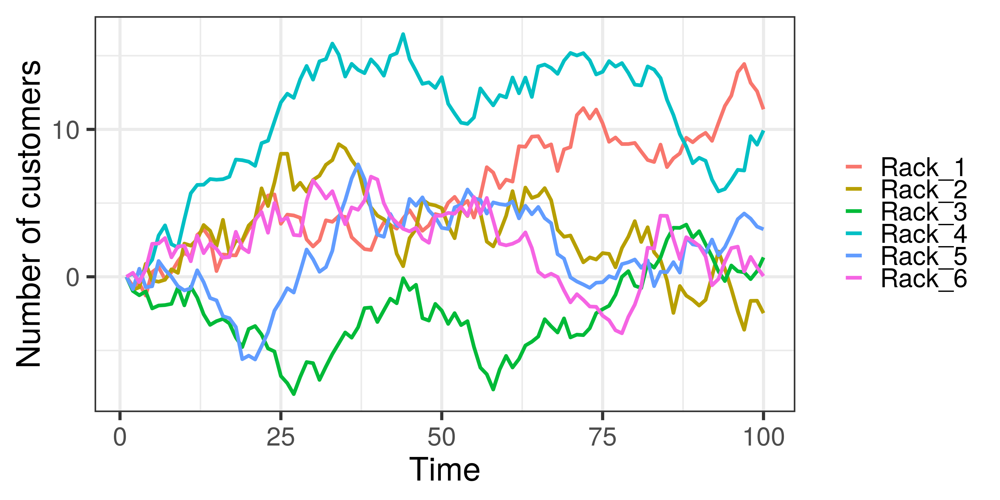

# Milestone Hackathon 2019: *Unlocking store layout potential with In-Store Optimization*

## Team members:

1. [Manuel Muñoz](https://www.linkedin.com/in/manuelmunozaguirre/) (Data Scientist)

2. [Raziel Amador](https://www.linkedin.com/in/raziel-amador-rios-14161268/) (Data Scientist)

3. [Rodrigo Hernandez](https://www.linkedin.com/in/raziel-amador-rios-14161268/) (MBA)

## Content:

1. [Project description](#description)
2. [Deep Neural Network for behaviour identification](#deep)
3. [Results](#results)

## 1) <a id='description'></a> Project description:

### Insights:

* Customer segmentation

* Popular clothes (hot spots)

* Shopper behavior

### Aims:

* **Increase in-store sales**: optimize product showcase and pricing strategy.
* **Boost profit**: adapt the store layout and promote cross-selling items.
* **Improve customer experience**: the right product in the right time.


## 2) <a id='deep'></a> Deep Neural Network to optimize in-store layout

We have implemented a computer vision system to study customer segmentation, identify hot spots and shopper behavior. It is based on a deep learning framework, [Mask-RCNN.](https://arxiv.org/abs/1703.06870)

The particular implementation of *Mask-RCNN* we used is pretrained on the [MS COCO dataset](https://arxiv.org/abs/1405.03120). We have forked from [this repository](https://github.com/minimaxir/person-blocker) and made modifications to suit our task.

Required libraries:
- numpy
- imageio
- python 3.4+
- Tensorflow 1.3+
- Keras 2.0.8+
- skimage
- scipy
- Pillow
- cython
- h5py
- matplotlib

To stitch the frames with `ffmpeg` use the following command:

```{r}
ffmpeg -start_number 0000 -i frame00%4d.jpg -c:v libx264 outfile.mp4
```
## 3) <a id='results'></a> Results:

* ### Customer segmentation:


* ### Popular clothes (hot spots):


* ### Shopper behavior:



